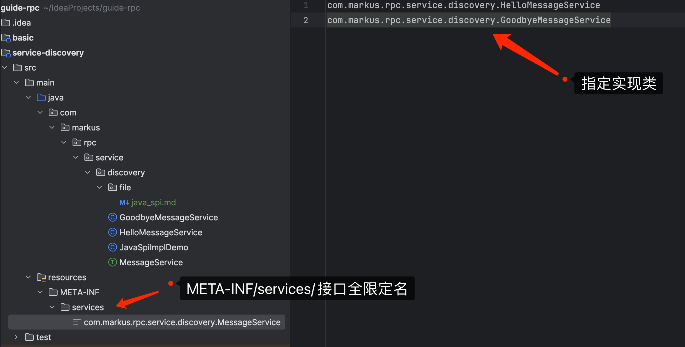

# Java SPI 机制介绍
## 什么是Java SPI？
SPI（Service Provider Interface）服务提供接口，是Java提供的一种服务发现机制。它允许服务提供者在运行时被查找或者加载，增加了程序的可扩展性。SPI的核心思想是面向接口编程，实现解耦合。开发者只需要通过接口来引用服务，具体的实现类可以在运行时动态加载，从而替换不同的实现。

## Java SPI的工作原理
Java SPI的工作机制涉及三个核心组成部分：服务提供接口、服务提供者和服务加载器。
1. 服务提供接口：定义了服务的标准，是一组抽象方法。 
2. 服务提供者：实现服务提供接口的具体类。 
3. 服务加载器：ServiceLoader类，用于加载服务的工具。
当服务的提供者提供了服务接口的一种具体实现后，需要在资源目录META-INF/services中创建一个以服务接口命名的文件。该文件中列出了实现该服务接口的具体实现类的全限定名。当外部程序装载这个模块的时候，ServiceLoader可以根据配置文件加载所有可用的服务提供者。

## 如何使用Java SPI
使用Java SPI机制包含以下几个步骤：
1. 定义服务接口：创建一个服务接口，定义需要提供的服务。
2. 实现服务接口：一个或多个独立的模块实现该服务接口。
3. 注册服务提供者：在模块的META-INF/services目录下创建一个以服务接口全限定名命名的文件，文件内容为实现类的全限定名。 
4. 服务加载：通过ServiceLoader类加载服务接口的实现，得到服务提供者的实例。

展现下相关代码和文件
```java
// 1. 定义服务接口
interface MessageService {
  String getMessage();
}
// 2. 实现服务接口
public class HelloMessageService implements MessageService {
  @Override
  public String getMessage() {
    return "Hello";
  }
}
public class GoodbyeMessageService implements MessageService {
  @Override
  public String getMessage() {
    return "Goodbye";
  }
}

// 3. 在模块的 META-INF/services目录下创建文件
// 4. 通过 ServiceLoader 进行类加载
public class JavaSpiImplDemo {
  public static void main(String[] args) {
    ServiceLoader<MessageService> services = ServiceLoader.load(MessageService.class);
    for (MessageService service : services) {
      System.out.println(service.getMessage());
    }
  }
}
```
第三步的文件创建：


## Java SPI的使用场景
Java SPI机制广泛应用于Java的核心库中，如JDBC、JCE、JNDI等。它也被广泛应用于很多流行的框架和工具中，例如Dubbo、Spring等，提供了一种服务扩展和替换的解决方案。
- Dubbo使用SPI来加载自定义的组件.
- 而Spring框架则利用SPI来支持各种数据库的实现。可以看看 FactoryBean 实现

这些框架的灵活性和可扩展性在很大程度上得益于Java SPI机制。

## Java SPI的优点
1. 解耦：服务提供者和服务消费者之间通过接口来通信，提高了模块间的独立性。 
2. 可插拔：可以很容易地添加或替换服务提供者。 
3. 动态发现：服务加载器可以动态发现并加载服务提供者，无需修改原有代码。

## Java SPI的局限性
1. 延迟加载：ServiceLoader不会预先加载服务提供者，每次调用都会重新加载。 
2. 单一实例：ServiceLoader每次只加载一个服务提供者实例。 
3. 性能问题：如果服务提供者数量较多，每次加载可能会有性能开销。

## 总结
Java SPI是一种强大的服务发现机制，它通过ServiceLoader的动态加载能力，为Java应用提供了高度的扩展性和灵活性。了解和掌握SPI机制，对于构建模块化、可扩展的Java应用至关重要。